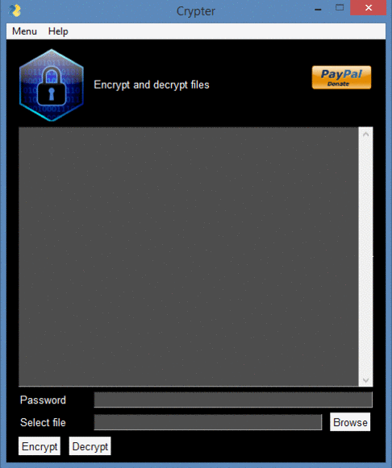

[](https://www.python.org/)

# Crypter

**Programmed in Python | PySimpleGUI**

[](https://github.com/adrijano/Crypter-v1.1/)

[](https://github.com/adrijano/Crypter-v1.1/graphs/commit-activity)

# If you like it give it a star

[](https://github.com/adrijano/Crypter-v1.1)



# How it works
```
Crypter program use Fernet for encryption.
Fernet guarantees that a message encrypted using it cannot be manipulated or read without the key. 
Fernet is an implementation of symmetric (also known as “secret key”) 
authenticated cryptography.

Generates a fresh fernet key. Keep this some place safe! 
If you lose it you’ll no longer be able to decrypt files.

```
# How to use

### Python3+

```
git clone https://github.com/adrijano/Crypter-v1.1.git

cd Crypter-v1.1 && pip install -r requirements.txt

python crypter.py
```
### Windows
```
cd dist 
crypter.exe
```


## Donations
If you would like to support me, donations are very welcome.

```
You can use Paypal to donate using your own credit card. 
The payment is processed by PayPal but you don't need to have a
PayPal account or sign-up for one if you are paying by credit card.

You can also use your own Paypal account to donate.
```
[](https://www.paypal.com/donate/?cmd=_s-xclick&hosted_button_id=PFB6A6HLAQHC2&source=url)

[](https://github.com/adrijano/Crypter-v1.1/)


# Disclaimer


**The code within this repository comes with no guarantee, the use of this code is your responsibility. I take NO responsibility and/or liability for how you choose to use any of the source code available here. By using any of the files available in this repository, you understand that you are AGREEING TO USE AT YOUR OWN RISK. Once again, ALL files available here are for EDUCATION and/or RESEARCH purposes ONLY.**


