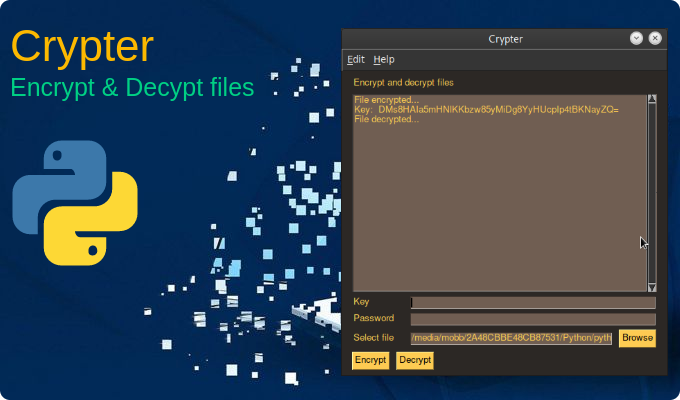
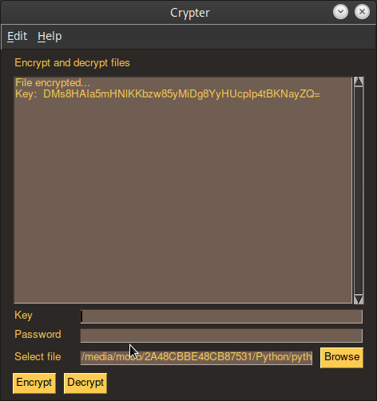
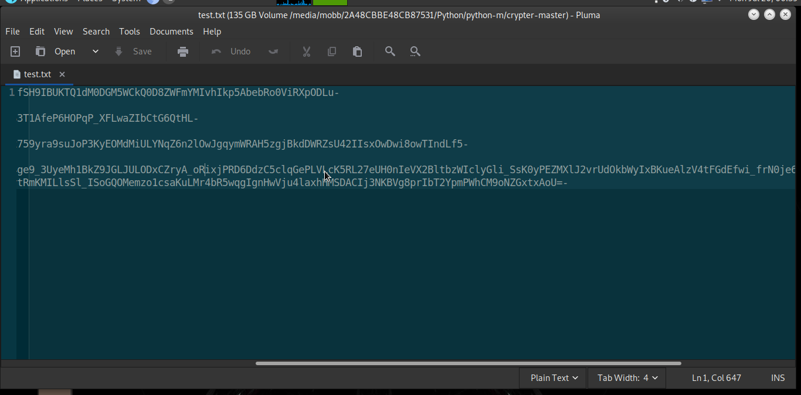
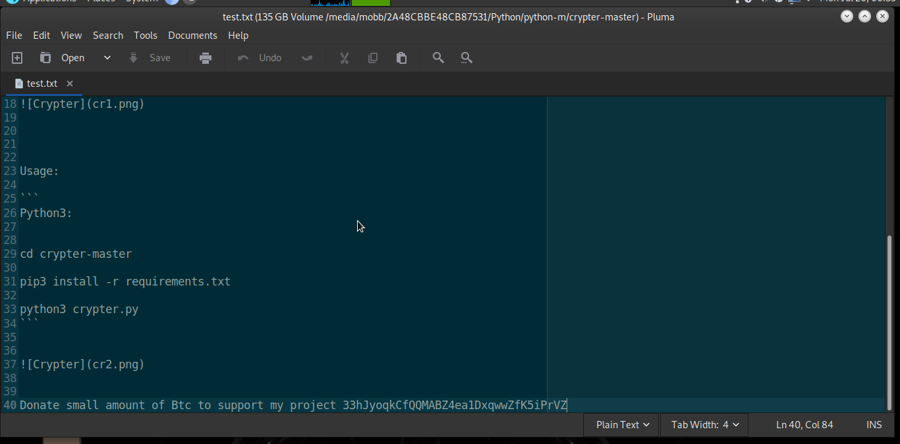

# Crypter


How it works:
```
Crypter program use Fernet for encryption.
Fernet guarantees that a message encrypted using it cannot be manipulated or 
read without the key. 
Fernet is an implementation of symmetric (also known as “secret key”) 
authenticated cryptography.

Generates a fresh fernet key. Keep this some place safe! If you lose it you’ll 
no longer be able to decrypt files.


```
Usage:

```
Python3:


cd crypter-master

pip3 install -r requirements.txt

python3 crypter.py

Windows:

cd dist folder
crypter.exe
```








Donate small amount of Btc to support my project 33hJyoqkCfQQMABZ4ea1DxqwwZfK5iPrVZ

